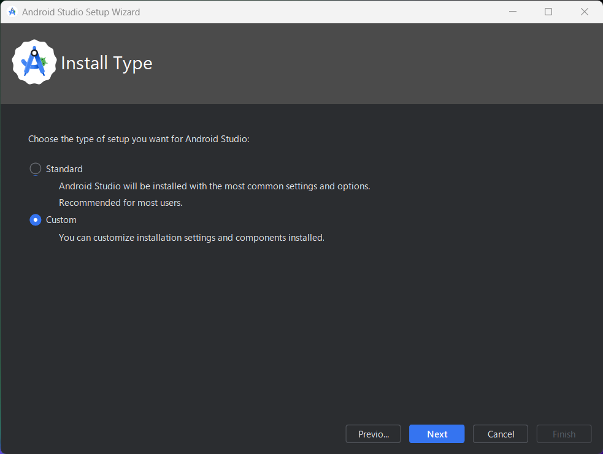
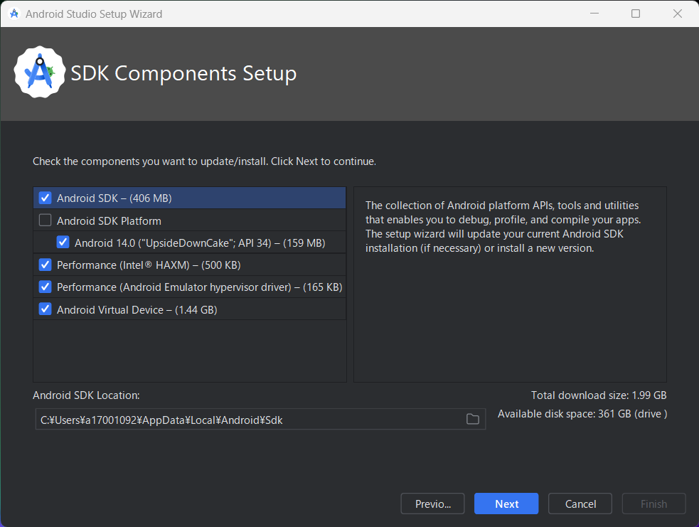
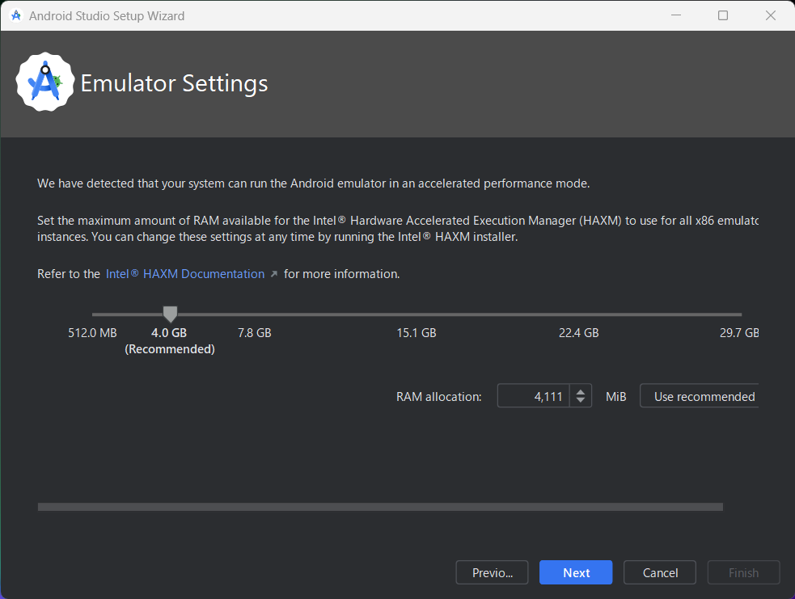

# react-native-template

ReactNative にてアプリ開発を実施する際にテンプレートとするリポジトリ  
配置してあるコンポーネントはサンプルです  
不要なものは削除して利用してください

## 注意！

改行コードの自動変換を`false`にしてください  
以下コマンドを実行することで設定できます

```
git config --global core.autocrlf false
```

以下コマンドで設定確認ができます

```
git config --global --list
or
git config --global -l
```

一覧の中に`core.autocrlf=false`というような記載があれば OK

# 1. 環境構築

## 1-1. 開発に必要なソフトウェアのインストール

まずは開発にて利用する各種ソフトウェアのインストールを行います  
一応参考サイトも載せておきますが、一生懸命書いたので  
下の手順に沿ってインストールを進めてもらえると嬉しいです

<u>**注意**</u>

下記手順は WindowsOS 向けの内容です  
MacOS 利用の方は参考サイトの内容にて環境構築をお願いします

#### 参考サイト

■ 公式の環境構築手順  
　英語に自信がある方はこちら

- [Setting up the development environment · React Native](https://reactnative.dev/docs/environment-setup?guide=native)

■ WindowsOS 向け

- [React Native を使用した Android 向けの開発の開始](https://learn.microsoft.com/ja-jp/windows/dev-environment/javascript/react-native-for-android)
- [ReactNative の環境構築方法](https://port365.jp/react-native/)

■ MacOS 向け

- [VisualStudioCode で ReactNative のデバッグ環境を構築する](https://qiita.com/t_okkan/items/2b6b94340b837189054c)
- [【React Native】 開発環境の構築とアプリ作成最初の一歩【初心者向け】](https://qiita.com/keneo/items/aaa5946bfa4d10353302)

#### 参考サイトの手順を見る人向け

後述しますが Android アプリ開発を行うため、JDK のインストールも必要になります  
上記サイトの手順では Android Studio（Android アプリ開発向け IDE）のインストールと別手順で導入していますが、  
Android Studio に JDK が同梱されていますので、別でインストールする必要はありません  
（すでに java8 を導入している方はそれを利用するでも OK です）

### **① IDE**

手始めに統合開発環境のインストールを行います  
以下手順で実施してください

### **①-1 Visual Studio Code**

まずは Visual Studio Code （以降 vscode）をインストールします  
（すでにインストール済みの方はそれを使うで OK です）  
以下サイトより、インストーラをダウンロードしてインストールを行ってください
https://code.visualstudio.com/

インストーラを起動して道なりにウィザードを進めていけば問題なくインストールできるかと思います

### **①-2 vscode の拡張機能**

vscode の拡張機能をインストールします  
Extensions から以下の拡張機能を検索してインストールしてください


[React Native Tools](https://marketplace.visualstudio.com/items?itemName=msjsdiag.vscode-react-native)

### **①-3 フォーマッタ（vscode の拡張機能）**

以下の拡張機能のインストールを行ってください

- [ESLint](https://marketplace.visualstudio.com/items?itemName=dbaeumer.vscode-eslint)
- [Prettier](https://marketplace.visualstudio.com/items?itemName=esbenp.prettier-vscode)

上記拡張機能の導入後、vscode の`setting.json`に以下を追加してください  
`File` > `Preferences` > `Settings` から設定を開き、  
右上の `Open Settings(JSON)` のアイコンを押下すると対象のファイルが開かれます

※ Windows 環境の場合は対象ファイルは以下にありますので、こちらを編集しても OK です  
`(ユーザーのホームディレクトリ)\AppData\Roaming\Code\User\settings.json`　　
ユーザーのホームディレクトリ = C:\Users\\(windows アカウント名)

```
  "editor.defaultFormatter": "esbenp.prettier-vscode",
  "editor.formatOnPaste": true,
  "editor.formatOnSave": true,
  "editor.tabSize": 2,
  "editor.codeActionsOnSave": {
    "source.fixAll": true
  },
  "eslint.validate": [
    "javascript",
    "typescriptreact",
    "javascript",
    "typescriptreact"
  ]
```

### **② Node.js インストール**

ReactNative では Javascript を動作させる必要がありますので、  
Javascript の実行環境となる Node.js を導入します  
LTS 版の Node.js であれば問題ないかと思いますが、  
こちらで動作確認ができている v18 系の Node.js 導入を行います

以下の手順に沿ってインストールしてください

#### **②-1 nvm-windows インストール**

まずはバージョンの選択をして、動作環境を構築できるようマネージャソフトを導入します

以下リンクにアクセスして、最新バージョンの `nvm-setup.exe` をダウンロードし、インストールを行なってください  
[Releases · coreybutler/nvm-windows](https://github.com/coreybutler/nvm-windows/releases)

以下コマンドを叩いて、バージョンが返ってくれば OK です

```
> nvm version

1.1.12
```

#### **②-2 nvm を使って Node.js インストール**

以下コマンドで、nvm が管理している Node.js のバージョン情報を確認できます

```
> nvm list available

|   CURRENT    |     LTS      |  OLD STABLE  | OLD UNSTABLE |
|--------------|--------------|--------------|--------------|
|    21.5.0    |   20.10.0    |   0.12.18    |   0.11.16    |
|    21.4.0    |    20.9.0    |   0.12.17    |   0.11.15    |
|    21.3.0    |   18.19.0    |   0.12.16    |   0.11.14    |
|    21.2.0    |   18.18.2    |   0.12.15    |   0.11.13    |
|    21.1.0    |   18.18.1    |   0.12.14    |   0.11.12    |
|    21.0.0    |   18.18.0    |   0.12.13    |   0.11.11    |
|    20.8.1    |   18.17.1    |   0.12.12    |   0.11.10    |
|    20.8.0    |   18.17.0    |   0.12.11    |    0.11.9    |
|    20.7.0    |   18.16.1    |   0.12.10    |    0.11.8    |
|    20.6.1    |   18.16.0    |    0.12.9    |    0.11.7    |
|    20.6.0    |   18.15.0    |    0.12.8    |    0.11.6    |
|    20.5.1    |   18.14.2    |    0.12.7    |    0.11.5    |
|    20.5.0    |   18.14.1    |    0.12.6    |    0.11.4    |
|    20.4.0    |   18.14.0    |    0.12.5    |    0.11.3    |
|    20.3.1    |   18.13.0    |    0.12.4    |    0.11.2    |
|    20.3.0    |   18.12.1    |    0.12.3    |    0.11.1    |
|    20.2.0    |   18.12.0    |    0.12.2    |    0.11.0    |
|    20.1.0    |   16.20.2    |    0.12.1    |    0.9.12    |
|    20.0.0    |   16.20.1    |    0.12.0    |    0.9.11    |
|    19.9.0    |   16.20.0    |   0.10.48    |    0.9.10    |

This is a partial list. For a complete list, visit https://nodejs.org/en/download/releases
```

上記確認後、LTS 18.系 の最新版を導入してください  
今回（2023/01/15 時点）は以下コマンドを実行し、18.19.0 を導入します  
※ 以降 expo や Storybook のアップデートで別バージョンが利用できるようになる可能性があります

```
> nvm install 18.19.0
```

インストールが完了したら、以下コマンドを実行し利用するバージョンを切り替えますが、  
まずは導入されている Node.js のバージョンを確認します

以下コマンドを入力し、↑ の手順でインストールしたバージョンと異なるバージョンが返ってくる、  
または node コマンドが利用できないようなエラーが表示されるかと思います

```
> node -v
```

<u>**注意**</u>  
この時バージョンが表示されている場合はプロジェクト業務で利用している  
Node.js がインストールされているものと思われます  
こちらでの作業が終わり次第、戻す必要があるかと思いますので  
表示されたバージョンはメモしておくなり、記憶するなりしておいてください

利用バージョンを以下のコマンドによって切り替えます

```
> nvm use 18.19.0
```

以下コマンドを実行し、切り替え後のバージョンが返ってくれば OK です

```
> node -v

v18.19.0
```

### **③ React Native CLI**

Node.js の インストールが済めば、パッケージマネージャーである  
npm の利用も可能となっているかと思います

React Native 開発の CLI もありますので、これをインストールしておきましょう

```
npm install -g react-native-cli
```

### **④ Chocolatey（Python の導入にしか使わないので飛ばしても OK です）**

以降諸々のインストールを行いますので、  
管理を容易にするべくパッケージマネージャーとなる Chocolatey を導入します  
Linux の yum などと同じような立ち位置のものと思ってください

以下リンクより `Now run the following command:` にあるコマンドをコピー
[Chocolatey Software | Installing Chocolatey](https://chocolatey.org/install#individual)

たぶん以下のようなコマンドがコピーされるかと思います

```
> Set-ExecutionPolicy Bypass -Scope Process -Force; [System.Net.ServicePointManager]::SecurityProtocol = [System.Net.ServicePointManager]::SecurityProtocol -bor 3072; iex ((New-Object System.Net.WebClient).DownloadString('https://community.chocolatey.org/install.ps1'))
```

コマンドプロンプトを管理者権限で実行より開き、コピーしたコマンドを実行してください

以下コマンドを実行してバージョンが帰ってきたら Chocolatey のインストールは完了です

```
> choco -v

2.2.2
```

### **⑤ Python インストール （導入済みの方は無視で OK です）**

ReactNative はビルド時に Python を利用しているため Python の実行環境が必要となります

#### Chocolatey を導入している方

以下コマンドを叩くだけだけです

```
> choco install -y python
```

#### Chocolatey を導入していない方

[Python の公式サイト](https://www.python.org/)よりインストーラをダウンロード、起動してインストールを行ってください  
3 系の最新版で OK です

#### インストール後の手順（Chocolatey の導入有無に関係なく実施してください）

Python はインストール後、実行可能とするために  
OS の再起動が必要となりますので OS の再起動を行ってください

例によって、バージョン確認コマンドを叩いてバージョンが帰ってくれば OK です

```
> python --version

Python 3.12.1
```

## 1-2. Android Studio の導入

Android Studio は Android アプリ開発向けの IDE です
今回の ReactNative 開発で利用する IDE は最初に導入してもらった vscode となるので、IDE としては利用しません

ただ、Android Studio には AndroidOS のエミュレータや Android SDK など、  
便利アイテムが同梱されていますので Android Studio の導入を行います

### ① Android Studio のインストール

[Android Studio の公式サイト](https://developer.android.com/studio?hl=ja)よりインストーラをダウンロードしてください  
（WindowsOS、MacOS どちらも上記サイトよりインストーラが取得できるはず）

インストーラを起動したら、 `Android Studio Setup` というタイトルのダイアログが表示されるかと思います  
各設定はデフォルトのまま当該ダイアログでのインストールを行ってください

それが完了し Android Studio を起動すると、  
今度は `Android Studio Setup Wizard` というダイアログが表示されますので、  
以降の手順に従って操作を行ってください

**(1) `Install Type` の画面にて `Custom` を選択**



**(2) `SDK Components Setup` の画面にて `Performance (Intel ® HAXM)` と `Android Virtual Device` を選択**

おそらく最初からチェックボックスにチェックが入った状態で表示されるかと思いますが、  
念のため確認し、チェックが入っていない場合にはチェックを入れてください



**(3) `Emulator Settings` の画面にて、推奨されるメモリ数を指定**



上記で進め、以降の画面はそのまま進めてもらえれば OK です

### ①-ex Android SDK のインストール（必要に応じて）

基本的には導入済みの SDK（Android 14.0 SDK）で動作しますので、  
実施は必須ではありませんが、他のバージョンの SDK が必要になった場合は、  
以下のように対応してください

インストール完了後、Android Studio を起動し表示された画面にて  
再度メニューの `Projects` を選択し、画面中央の `More Actions` > `SDK Manager` を押下すると  
設定画面( `Settings` > `Languages & Frameworks` > `Android SDK`)が開きますので、ここで必要なバージョンの SDK を選択して Apply ボタンを押下してください  
すると選択した Android SDK のインストールが行われます

ちなみに、ReactNative が動作するのは Android 6.0 以上となっています

### ② 環境変数の設定

システム環境変数にそれぞれ以下を設定してください

| 対応     | 変数（キー） | 値                                                                      |
| -------- | ------------ | ----------------------------------------------------------------------- |
| 新規追加 | JAVA_HOME    | C:\Program Files\Android\Android Studio\jbr                             |
| 新規追加 | ANDROID_HOME | (ユーザーのホームディレクトリ)\AppData\Local\Android\Sdk                |
| 追記     | path         | (ユーザーのホームディレクトリ)\AppData\Local\Android\Sdk\platform-tools |

`path` 設定の確認のため以下コマンドを実行し、記載のように表示されれば OK です

```
> adb

Android Debug Bridge version 1.0.41
Version 34.0.5-10900879
Installed as C:\Users\a17001092\AppData\Local\Android\Sdk\platform-tools\adb.exe
Running on Windows 10.0.22621

～ 長いので以下省略 ～
```

## 1-3. アプリケーション起動

### 1-3-1. アプリケーション起動手順

以下コマンドを実行することで、[Metro](https://metrobundler.dev/)という JavaScript の Bundler が起動します  
これは React Native で記載したコードをトランスパイルし、  
依存関係を含めた開発モジュールを 1 つの JavaScript ファイルにまとめます

```
> npm start
```

起動するとコンソール上に以下のような出力がされます


今回は Android エミュレータにて起動を行いますので、  
案内の通り、`a` キーを押下します

すると、Android エミュレータ上でアプリを立ち上げることができます

### 1-3-2. Storybook の起動手順

本プロジェクトはコンポーネントのカタログとなる Storybook を導入しています  
[Storybook: UI component explorer for frontend developers](https://storybook.js.org/)

作成したコンポーネントをブラウザにて確認できますので、利用してください

Storybook は Node.js のバージョンが 16 系でないと動作してくれないため、  
一度 Node.js のバージョンを下げます

```
> nvm install 16.20.2
> nvm use 16.20.2
```

対象プロジェクトの`package.json`がある階層まで移動して、以下コマンドを実行してください

```
> npm install
または
> npm i
```

完了したら、以下コマンドを実行して Storybook サーバーの立ち上げとブラウザの表示がされていれば OK です  
コマンド実行後、Storybook の画面が自動で立ち上がります

```
> npm run storybook
```

### ex. プロジェクトの作成 〜 Storybook 適用まで

以下コマンドを実行し、プロジェクトを作成してください

```
npx create-expo-app src
```

コマンド実行後、対話式で処理が進むので、  
`blank(typescript)`を選択し、続行してください

プロジェクト作成が完了したら、作成したプロジェクトの  
ディレクトリに移動し、Storybook を導入する  
※ type オプションに react_native も存在しますが動作しないため、react を指定してください

```
cd src
npx -p @storybook/cli sb init --type react
```

CoreComponents のみであれば、上記の対応で動作しますが、  
他のライブラリを利用している場合は react-native-web として、  
Storybook にコンポーネントを渡してやる必要があります
そのため、以下をコマンドを実施して対象の addon を導入してください

```
npm install --save-dev @storybook/addon-react-native-web
```

その後、`./storybook/main.js`に以下を追記してください

```
module.exports = {
  addons: [
    /*existing addons,*/
    {
      name: '@storybook/addon-react-native-web',
      options: {
        modulesToTranspile: ['react-native-package-name'],
      },
    },
  ],
};
```

完了後、以下コマンドを実行し、Storybook が起動すれば OK

```
npm run storybook
```

参考：
[Storybook for React Native tutorial](https://storybook.js.org/tutorials/intro-to-storybook/react-native/en/get-started/),
[React Native Web addon for Storybook](https://storybook.js.org/addons/@storybook/addon-react-native-web)

# 2. コーディングルール

---

## 2-0. 田中コメント（この項番は後で消します）

- 2-2-1.の b-4 と d は要見直しかなと思っています
  - b-4 と c：pages がただ templates をラップするだけの存在になりそう  
    SPA 的に処理するなら pages の中で State 管理と表示するコンポーネントの変更を行う、  
    とかで棲み分けはできそうだけど…  
    みんなの所感を聞いて判断したい
  - d：アーキテクチャによって見直しが必要になるため
- 2-3-2.は記載の統一が目的なので、みんなの好みに合わせたいです

---

## 2-1. 目的

メンテナンス性の向上や属人化を防ぐため、プロジェクト全体のコードスタイルの統一化を図る目的で導入します  
また、エラーが発生しない記法でも、バグの温床となり得るものがあるため、それを防ぐためのルールもこちらで定義します  
（不足等があれば、適宜追加・変更してください）

## 2-2. フォルダ・ファイルのルール

### 2-2-1. フォルダ構成

フォルダ構成は以下のようにしてください  
（拡張子がないものはディレクトリとします）

```
src
├── __tests__ 等の自動生成ファイル
├── components
│   ├── atoms
│   │   ├── Tekitou
│   │   │   ├── Tekitou.tsx
│   │   │   ├── styles.ts
│   │   │   └── Tekitou.stories.tsx
│   │   ├── ・
│   │   ├── ・
│   │   ├── ・
│   │   └── Hoge
│   ├── molecules
│   ├── organisms
│   └── templates
├── pages
│   ├── index.tsx
│   └── something.tsx
├── api
│   ├── hoge.ts
│   ├── ・
│   ├── ・
│   ├── ・
│   └── fuga.ts
├── resources
│   ├── theme
│   │   ├── font.ts
│   │   ├── color.ts
│   │   ├── ・
│   │   ├── ・
│   │   ├── ・
│   │   └── theme.ts
│   ├── messages
│   └── constants
│
```

#### **a）src（ルートディレクトリ）**

上記では仮で src にしていますが、管理しやすさの観点から任意の名前に変更推奨とします  
プロジェクトの名前を設定すると、いざ名前変更がされた時にリファクタリングが必要になるので、プロジェクト名とは無関係の渾名をつけることを推奨します

#### **b）src/components**

各コンポーネントを配置するディレクトリです  
配置はコンポーネントの粒度<sup>[注 1]</sup>に合わせて、`atoms`、`molecules`、`organisms`、`templates`に配置してください

#### **b-1）src/components/atoms**

最も小さいコンポーネントを配置するディレクトリです  
`button`や`input`等、html タグ要素レベルのコンポーネントを配置します  
コンポーネントディレクトリの構成については b-5 を参照してください  
表示する値は、固定値または props で与えられたもののみとし、このコンポーネントではアプリケーション外部からのデータ取得は行わないものとします

#### **b-2）src/components/molecules**

いくつかの`atoms`コンポーネントを組み合わせて作るコンポーネントを配置します  
入力画面の 1 入力項目や検索窓相当のコンポーネントをここに配置してください  
表示する値は、固定値または Props で与えられたもののみとし、このコンポーネントではアプリケーション外部からのデータ取得は行わないものとします

#### **b-3）src/components/organisms**

いくつかの`atoms`、`molecules`コンポーネントを組み合わせて作るコンポーネントを配置します  
表やスレッドなど、複数の`molecules`コンポーネントを組み合わせる必要があるものや、データ取得が伴うものはこのディレクトリに配置してください

#### **b-4）src/components/templates**

いくつかの`molecules`、`organisms`コンポーネントを組み合わせて作るコンポーネントを配置します  
ここに配置するのは 1 画面単位のコンポーネントとしてください

#### **b-5）src/components/atoms/Tekitou**

図では atoms の中に配置していますが、コンポーネントを配置する場合は、  
他のディレクトリ（molecules、organisms、templates）に対しても同様としてください  
一例として、`Tekitou`としていますが、このディレクトリには対象のコンポーネント名を設定してください  
（例）コンポーネント ManuBar を定義したファイルを含むディレクトリは、ManuBar とします

この`Tekitou`が 1 コンポーネント単位となるイメージです  
配下は以下のようにファイルを配置します

- Tekitou.tsx  
  　コンポーネント定義を行なっているファイルを配置します
- styles.ts  
  　対象コンポーネントにて固有で設定が必要なスタイルの定義を行います
- Tekitou.stories.tsx  
  　 StoryBook に載せるためのファイルです  
  　 title 要素には components から対象コンポーネントへのパスを設定してください  
  　（例）atoms/Tekitou

#### **c）src/pages**

各画面の定義ファイルを配置します

#### **d）src/api**

アプリケーション外部からのデータ取得系処理の定義ファイルを配置します

#### **e）src/resources**

各定数管理ファイルを配置するディレクトリです

#### **e-1）src/resources/theme**

各スタイル系の定数の定義ファイルを配置します  
ファイルが複数あると利用する際にコンポーネント定義ファイル冒頭にくる import 文の量を増やしてしまう可能性があるので、  
`theme.ts`にオブジェクトを定義し、そのオブジェクト経由で各テーマの値を利用するようにします

#### **e-2）src/resources/messages**

メッセージリソースを配置します

#### **e-3）src/resources/constants**

共通して利用する定数を配置します

### 2-2-2. ファイル拡張子

純粋な Typescript のみのファイルは`.ts`、JSX 要素を含むファイルは`.tsx`としてください

### 2-2-3. 文字コード・改行コード

- 文字コード：UTF-8
- 改行コード：CRLF

## 2-3. コーディングスタイル

基本的には ESLint のルールに倣って実装してください  
（拡張機能を install していれば、リアルタイムで見てくれる）

### 2-3-1. インデント

半角スペース 2 つを 1 単位としてインデントを行ってください  
（tab 等でのインデントは禁止）

### 2-3-2. 命名規則

#### **a）変数・メソッドは lowerCamelCase で命名する**

```
const someVariable = 0;
const someMethod = (someArgument: string) => {};
```

#### **b）クラス・インターフェース・コンポーネントは UpperCamelCase で命名する**

```
class SomeClass {
    someProp: number; // プロパティはlowerCamelCase
}
interface SomeInterface {
    someAttr: string;
}
const SomeComponent = (props: SomeInterface) => {}
```

#### **c）定数は UPPER_SNAKE_CASE で命名する**

```
const SOME_CONSTANT = 'this is constant.';
```

#### **d）原則メソッドは動詞（助動詞）始まりとする**

```
const getOption = () => {};
const canAddItems = () => {};
```

例外として、動詞を省略しても良いものは動詞始まりでなくとも良いものとします

```
const toString = () => {};
```

### 2-3-3. 変数スコープ

#### **a）変数宣言時は`const`を利用する**

基本的に利用する変数のスコープが不必要に広がらないよう、ブロックスコープとなる`const`、`let`を利用することが推奨されます
これらは以下のように使い分けられます

- const: 再代入しないもの
- let: 再代入するもの

ですが、再代入を防ぎ、バグ混入のリスクを軽減するため、変数宣言時は`const`を利用するようにしてください

```
if (enabled) {
    const initial = 0;
    let sum = initial; // どうしても必要な時だけ

    for (const element of array) {
        sum = sum + element;
    }
}
```

### 2-3-4. object 系

#### **a）オブジェクト生成時は[リテラル構文](https://typescriptbook.jp/reference/values-types-variables/object/object-literal)を利用する**

```
// bad
const someObject = new Object();

// good
const someObject = {};
```

配列も同様です

```
// bad
const someArray = new Array();

// good
const someArray = [];
```

### 2-3-5. string 系

#### **a）文字列の連結は行わず、[テンプレートリテラル](https://typescriptbook.jp/reference/values-types-variables/string#%E3%83%86%E3%83%B3%E3%83%97%E3%83%AC%E3%83%BC%E3%83%88%E3%83%AA%E3%83%86%E3%83%A9%E3%83%AB)を利用する**

```
// bad
const errorMessage = '登録できる' + data + 'の上限を超えたため、登録できません。';

// good
const errorMessage = `登録できる${data}の上限を超えたため、登録できません。`;

```

参考：データ定義有無で文字列の内容を変えたい場合、以下のような記載も可能です

```
const queryParam = `id=1${ data ? `&data=${data}` : '' }`;
```

#### **b）コード内の通常文字列はシングルクォートまたはバッククォートを使用する**

```
// bad
const placeHolder = "Please enter!";

// good
const placeHolder = 'Please enter!';
const width = `calc(${theme.full} - ${sidebarWidth}px)`;
```

#### **c）コンポーネントの属性に設定する固定値はダブルクォートを使用する**

```
// bad
<Button type='submit'/>

// good
<Button type="submit"/>
```

### 2-3-6. コンポーネント

#### **a）コンポーネント定義は関数コンポーネントを利用する**

記述量を減らすため、コンポーネント定義の際は、クラスコンポーネントではなく、関数コンポーネントを利用してください

```
// bad
class Greeting extends React.Component {
  render() {
    return <View>Hello, {this.props.name}</View>;
  }
}

// good
function Greeting(props) {
  return <View>Hello, {props.name}</View>;
}
```

# 4. 禁止事項

### 4-1. `any`、`unknown`は原則禁止

`any`、`unknown` = どんな型でも許される型 です  
コンパイラが型チェックしてくれないので、バグが増える恐れがあります  
必要箇所以外は基本利用しないようにしてください

### 4-2. `eval()`は利用しない

利用箇所はセキュリティホールになり得るため、eval()は利用しないようにしてください  
[eval() - JavaScript | MDN](https://developer.mozilla.org/ja/docs/Web/JavaScript/Reference/Global_Objects/eval#eval_%E3%82%92%E4%BD%BF%E3%82%8F%E3%81%AA%E3%81%84%E3%81%A7%E3%81%8F%E3%81%A0%E3%81%95%E3%81%84!)

# ex-0. ノート（Github 有料版が使えるなら wiki に移したい）

React では普通に div やら input やらが使えたりしますが、ReactNative はそうじゃないっぽいです

それらに近い挙動となる CoreComponents なる汎用コンポーネントがあったのでこれを使いましょう
[Core Components and APIs - React Native](https://reactnative.dev/docs/components-and-apis)
[Core Components and Native Components](https://reactnative.dev/docs/intro-react-native-components)

# ex-1. 参考

[注 1]: Atomic Design

- [Atomic Design](https://atomicdesign.bradfrost.com/table-of-contents/)：Official なやつ
- [アトミックデザインとは？メリットや気を付けるポイントを徹底解説！](https://spice-factory.co.jp/web/about-atmicdesign/)：こっちの方がわかりやすいと思う
