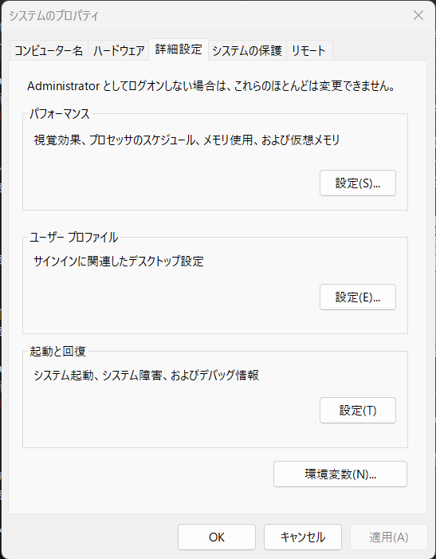
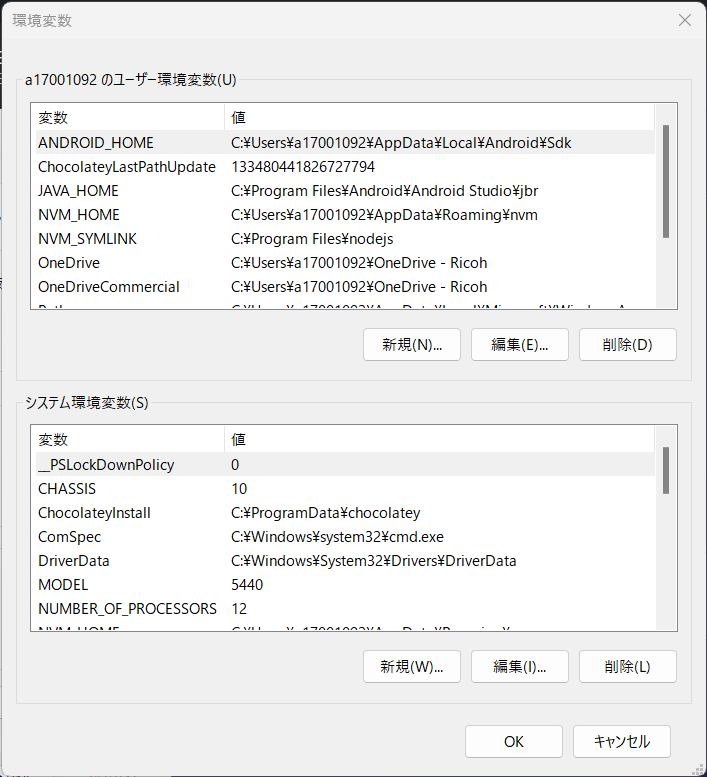

# React Native 環境構築手順

本リポジトリは [React Native](https://reactnative.dev/) のハンズオン用リポジトリです  
ハンズオン前に以下手順にしたがって環境構築を行ってください

一応参考サイトも載せておきますが、一生懸命書いたので  
下の手順に沿ってインストールを進めていただけると嬉しいです

<u>**注意**</u>

下記手順は WindowsOS 向けの内容です  
MacOS 利用の方は[参考サイト](#付録-参考サイト)の内容にて環境構築をお願いします

## 目次

- [1. 開発に必要なソフトウェアのインストール](#1-開発に必要なソフトウェアのインストール)
  - [1-1. 統合開発環境](#1-1-統合開発環境)
  - [1-2. Node.js](#1-2-nodejs)
  - [1-3. React Native CLI](#1-3-react-native-cli)
  - [1-4. Chocolatey（Python と Git の導入にしか使わないので飛ばしても OK です）](#1-4-chocolateypython-と-git-の導入にしか使わないので飛ばしても-ok-です)
  - [1-5. Python（導入済みの方は無視で OK です）](#1-5-python導入済みの方は無視で-ok-です)
  - [1-6. Git（導入済みの方は無視で OK です）](#1-6-git導入済みの方は無視で-ok-です)
- [2. Android Studio の導入](#2-android-studio-の導入)
  - [2-1. Android Studio のインストール](#2-1-android-studio-のインストール)
  - [2-2. 環境変数の設定](#2-2-環境変数の設定)
- [3. アプリケーション起動](#3-アプリケーション起動)
  - [3-1. リポジトリのクローン](#3-1-リポジトリのクローン)
  - [3-2. アプリケーション起動手順](#3-2-アプリケーション起動手順)
- [付録. 参考サイト](#付録-参考サイト)

## 1. 開発に必要なソフトウェアのインストール

開発にて利用する各種ソフトウェアのインストールを行います

### **1-1. 統合開発環境**

手始めに統合開発環境（以降 IDE）のインストールを行います  
以下手順で実施してください

### **1-1-1. Visual Studio Code インストール**

まずは Visual Studio Code （以降 vscode）をインストールします  
（すでにインストール済みの方はそれを使うで OK です）  
以下サイトより、インストーラをダウンロードしてインストールを行ってください  
https://code.visualstudio.com/

インストーラを起動して道なりにウィザードを進めていけば問題なくインストールできるかと思います

### **1-1-2 フォーマッター、リンター（vscode の拡張機能、ここはお好みで良いです）**

以下の拡張機能のインストールを行ってください

- [Prettier](https://marketplace.visualstudio.com/items?itemName=esbenp.prettier-vscode)
- [ESLint（厳密にはリンター）](https://marketplace.visualstudio.com/items?itemName=dbaeumer.vscode-eslint)

#### **補足（フォーマッター設定を変えたい人向け、特にこだわりが無い人は操作不要です）**

設定内容（`/.vscode/settings.json`）を見ていただけるとわかりますが、  
設定内容は以下の通りです

```
{
  "editor.defaultFormatter": "esbenp.prettier-vscode",
  "editor.formatOnPaste": true,
  "editor.formatOnSave": true,
  "editor.tabSize": 2,
  "editor.insertSpaces": true,
  "editor.codeActionsOnSave": {
    "source.fixAll.eslint": true
  },
  "eslint.validate": [
    "javascript",
    "javascriptreact",
    "typescript",
    "typescriptreact"
  ]
}
```

好き嫌いはあると思うので、気に入らないときは上記を編集してください

vscode の UI から編集するときは以下<u>**いずれか**</u>の操作で設定画面が開けますのでそこから編集可能です  
(a). `Ctrl + ,` を押下する  
(b). `File` > `Preferences` > `Settings` から設定を開く  
　 日本語設定されている場合は ファイル > ユーザー設定 > 設定 から設定を開く

<u>**注意**（プロジェクト業務で vscode を利用されている方向け）</u>  
この時 <u>User 設定の方を編集しないよう</u> 注意してください  
（プロジェクトにて vscode を利用している場合、影響がないようにするため）

↑ の操作で開いた設定画面は初期表示時、User 設定の画面が表示されます  
表示後、Workspace 設定に切り替えてから編集するようにしてください


### **1-2. Node.js**

React Native では Javascript を動作させる必要がありますので、  
Javascript の実行環境となる Node.js を導入します  
LTS 版の Node.js であれば問題ないかと思いますが、  
こちらで動作確認ができている v18 系の Node.js 導入を行います

以下の手順に沿ってインストールしてください

#### **1-2-1. nvm-windows インストール**

nvm（Node Version Manager）という、読んで字のごとく
各バージョンの Node.js の管理を行うソフトのインストールを行います

これにより各バージョンの Node.js のインストールのみではなく、
任意のタイミングで利用する Node.js のバージョンを切り替えることもできるようになります

以下リンクにアクセスして、最新バージョンの `nvm-setup.exe` をダウンロードし、インストールを行なってください  
[Releases · coreybutler/nvm-windows](https://github.com/coreybutler/nvm-windows/releases)

コマンドプロンプト（[※](#※-コマンドの実行について)）にて以下コマンドを叩いて、  
バージョンが返ってくれば OK です

```
> nvm version

1.1.12
```

#### **※ コマンドの実行について**

以降の手順もコマンドの実行操作を何度か行います  
<u>**誘導がない限りは「管理者として実行」で開いたコマンドプロンプト**</u>にて、  
コマンドを実行するようにお願いします

「管理者として実行」とした場合であれば、PowerShell でも可能です

#### **1-2-2. nvm を使って Node.js インストール**

前項に続きコマンドプロンプトを利用します  
以下コマンドで、nvm が管理している Node.js のバージョン情報を確認できます

```
> nvm list available

|   CURRENT    |     LTS      |  OLD STABLE  | OLD UNSTABLE |
|--------------|--------------|--------------|--------------|
|    21.5.0    |   20.10.0    |   0.12.18    |   0.11.16    |
|    21.4.0    |    20.9.0    |   0.12.17    |   0.11.15    |
|    21.3.0    |   18.19.0    |   0.12.16    |   0.11.14    |
|    21.2.0    |   18.18.2    |   0.12.15    |   0.11.13    |
|    21.1.0    |   18.18.1    |   0.12.14    |   0.11.12    |
|    21.0.0    |   18.18.0    |   0.12.13    |   0.11.11    |
|    20.8.1    |   18.17.1    |   0.12.12    |   0.11.10    |
|    20.8.0    |   18.17.0    |   0.12.11    |    0.11.9    |
|    20.7.0    |   18.16.1    |   0.12.10    |    0.11.8    |
|    20.6.1    |   18.16.0    |    0.12.9    |    0.11.7    |
|    20.6.0    |   18.15.0    |    0.12.8    |    0.11.6    |
|    20.5.1    |   18.14.2    |    0.12.7    |    0.11.5    |
|    20.5.0    |   18.14.1    |    0.12.6    |    0.11.4    |
|    20.4.0    |   18.14.0    |    0.12.5    |    0.11.3    |
|    20.3.1    |   18.13.0    |    0.12.4    |    0.11.2    |
|    20.3.0    |   18.12.1    |    0.12.3    |    0.11.1    |
|    20.2.0    |   18.12.0    |    0.12.2    |    0.11.0    |
|    20.1.0    |   16.20.2    |    0.12.1    |    0.9.12    |
|    20.0.0    |   16.20.1    |    0.12.0    |    0.9.11    |
|    19.9.0    |   16.20.0    |   0.10.48    |    0.9.10    |

This is a partial list. For a complete list, visit https://nodejs.org/en/download/releases
```

上記確認後、LTS 18.系 の最新版を導入してください  
今回（2023/01/15 時点）は以下コマンドを実行し、18.19.0 を導入します

```
> nvm install 18.19.0
```

インストールが完了したら、以下コマンドを実行し利用するバージョンを切り替えますが、  
まずは導入されている Node.js のバージョンを確認します

以下コマンドを入力し、↑ の手順でインストールしたバージョンと異なるバージョンが返ってくる、  
または node コマンドが利用できないようなエラーが表示されるかと思います

```
> node -v
```

<u>**注意**</u>  
この時バージョンが表示されている場合はプロジェクト業務で利用している  
Node.js がインストールされているものと思われます  
こちらでの作業が終わり次第、戻す必要があるかと思いますので  
表示されたバージョンはメモしておくなり、記憶するなりしておいてください

利用バージョンを以下のコマンドによって切り替えます

```
> nvm use 18.19.0
```

以下コマンドを実行し、切り替え後のバージョンが返ってくれば OK です

```
> node -v

v18.19.0
```

### **1-3. React Native CLI**

Node.js の インストールが済めば、パッケージマネージャーである  
npm（Node Package Manager）の利用も可能となっているかと思います

React Native 開発の CLI もありますので、これをインストールしておきましょう

```
npm install -g react-native-cli
```

### **1-4. Chocolatey（Python と Git の導入にしか使わないので飛ばしても OK です）**

以降諸々のインストールを行いますので、  
管理を容易にするべくパッケージマネージャーとなる Chocolatey を導入します  
Linux の yum などと同じような立ち位置のものと思ってください

以下リンクより `Now run the following command:` にあるコマンドをコピー  
[Chocolatey Software | Installing Chocolatey](https://chocolatey.org/install#individual)

たぶん以下のようなコマンドがコピーされるかと思います

```
> Set-ExecutionPolicy Bypass -Scope Process -Force; [System.Net.ServicePointManager]::SecurityProtocol = [System.Net.ServicePointManager]::SecurityProtocol -bor 3072; iex ((New-Object System.Net.WebClient).DownloadString('https://community.chocolatey.org/install.ps1'))
```

上記コマンドを実行しますが、<u>コマンドプロンプトでは実行できません</u>  
**PowerShell**を管理者権限で開き、コピーしたコマンドを実行してください

以下コマンドを実行してバージョンが帰ってきたら Chocolatey のインストールは完了です

```
> choco -v

2.2.2
```

### **1-5. Python（導入済みの方は無視で OK です）**

React Native はビルド時に Python を利用しているため Python の実行環境が必要となります

#### Chocolatey を導入している方

コマンドプロンプトを開き、以下コマンドを叩くだけだけです

```
> choco install python
```

Chocolatey を利用したインストールは失敗することがあるようです  
上記コマンドを実行して、インストールが正常に行われなければ、  
[Chocolatey を導入していない方](#chocolatey-を導入していない方)に記載の手順同様、  
[Python の公式サイト](https://www.python.org/)よりインストーラを取得し、インストーラよりインストールを行ってください

#### Chocolatey を導入していない方

[Python の公式サイト](https://www.python.org/)よりインストーラをダウンロード、起動してインストールを行ってください  
3 系の最新版で OK です

#### Python インストールの確認

Python はインストール後、実行可能とするために  
OS の再起動が必要となりますので OS の再起動を行ってください

例によって、バージョン確認コマンドを叩いてバージョンが返ってくれば OK です

```
> python --version

Python 3.12.1
```

### **1-6. Git（導入済みの方は無視で OK です）**

おなじみの Git です  
React Native 開発環境で利用するわけではありませんが、  
ハンズオンで利用するソースコードは Github 越しに展開しますので  
導入されていない方は導入をお願いします

#### Chocolatey を導入している方

コマンドプロンプトを開き、以下コマンドを叩くだけだけです

```
> choco install git
```

#### Chocolatey を導入していない方

Python と同様に [Git の公式サイト](https://git-scm.com/)よりインストーラをダウンロード、起動してインストールを行ってください  
最新版で OK です

#### Git インストールの確認

例によって、バージョン確認コマンドを叩いてバージョンが帰ってくれば OK です

```
> git --version

git version 2.43.0.windows.1
```

## 2. Android Studio の導入

Android Studio は Android アプリ開発向けの IDE です  
今回の React Native 開発で利用する IDE は最初に導入していただいた vscode となるので、IDE としては利用しません

ただ、Android Studio には AndroidOS のエミュレータや Android SDK など、  
便利アイテムが同梱されていますので Android Studio の導入を行います

### 2-1. Android Studio のインストール

[Android Studio の公式サイト](https://developer.android.com/studio?hl=ja)よりインストーラをダウンロードしてください  
（WindowsOS、MacOS どちらも上記サイトよりインストーラが取得できるはず）

インストーラを起動したら、 `Android Studio Setup` というタイトルのダイアログが表示されるかと思います  
各設定はデフォルトのまま当該ダイアログでのインストールを行ってください

それが完了し Android Studio を起動すると、  
今度は `Android Studio Setup Wizard` というダイアログが表示されますので、  
以降の手順に従って操作を行ってください

**(1) `Install Type` の画面にて `Custom` を選択**


**(2) `SDK Components Setup` の画面にて `Performance (Intel ® HAXM)` と `Android Virtual Device` を選択**

おそらく最初からチェックボックスにチェックが入った状態で表示されるかと思いますが、  
念のため確認し、チェックが入っていない場合にはチェックを入れてください


**(3) `Emulator Settings` の画面にて、推奨されるメモリ数を指定**


上記で進め、以降の画面はそのまま進めていただければ OK です

### 2-2. 環境変数の設定

システム環境変数の設定を行います

システム環境変数の設定画面は以下手順にて開くことができます  
Windows のバージョンによって少し手順が変わりますので注意してください

**利用 OS が Windows11 の場合**

1. スタートボタン右クリックで開くコンテキストメニューより`設定`を押下
2. 開いたウィンドウの左メニューにある`システム`を押下
3. 右ペインの一番下にある`バージョン情報`を押下
4. 右ペインの中央付近に表示される`システムの詳細設定`を押下

**利用 OS が Windows10 の場合**

1. スタートボタン右クリックで開くコンテキストメニューより`設定`を押下
2. 開いたウィンドウにある`システム`を押下
3. 左メニューにある`詳細情報`を押下
4. 右ペインの下部（要スクロール）に表示される`システムの詳細設定`を押下

上記手順により以下画面が表示されるかと思います



この画面から、`環境変数`ボタンを押下すると以下の画面が開けます



この画面よりシステム環境変数の設定が可能です  
システム環境変数にそれぞれ以下を設定してください

設定の際は画面上側に表示される、<u>`(windows アカウント名) のユーザー環境変数`にて設定を行ってください</u>  
対応列が「新規追加」となっているものは`新規`ボタンを押下して追加、  
「追記」となっているものは対象変数を選択肢、`編集`ボタンを押下して  
末尾に対象の値を追加する対応を行ってください

| 対応     | 変数（キー） | 値                                                                        |
| -------- | ------------ | ------------------------------------------------------------------------- |
| 新規追加 | JAVA_HOME    | C:\Program Files\Android\Android Studio\jbr                               |
| 新規追加 | ANDROID_HOME | C:\Users\\(windows アカウント名)\AppData\Local\Android\Sdk                |
| 追記     | Path         | C:\Users\\(windows アカウント名)\AppData\Local\Android\Sdk\platform-tools |

`Path` 設定の確認のため以下コマンドを実行し、記載のように表示されれば OK です

```
> adb

Android Debug Bridge version 1.0.41
Version 34.0.5-10900879
Installed as C:\Users\(windows アカウント名)\AppData\Local\Android\Sdk\platform-tools\adb.exe
Running on Windows 10.0.22621

～ 長いので以下省略 ～
```

## 3. アプリケーション起動

以下手順にて、Android エミュレータ上でアプリを起動します

### 3-1. リポジトリのクローン

ハンズオンでは、このリポジトリにあるプロジェクトを使います  
ローカルへクローンしておいてください  
場所は任意で OK です

#### **クローン前の注意点**

改行コードの自動変換を`false`にしてください  
以下コマンドを実行することで設定できます

```
git config --global core.autocrlf false
```

<u>※.gitconfig が存在しない旨のエラーが出力された場合</u>

新規導入の場合は .gitconfig ファイルが存在せず、  
上記コマンドを実行してもエラーとなる場合があります

その際は以下のコマンドを実行してください

```
> git config --global --edit
```

おそらくコマンドプロンプト上でエディターが開くかと思いますので、  
`:q!`と入力し Enter キーを押すとエディターを閉じることができます

このコマンドの実行により .gitconfig ファイルが作成されるかと思います  
以下パスに .gitconfig ファイルができていれば OK です  
`C:\Users\(windows アカウント名)\.gitconfig`

以下コマンドで設定確認ができます

```
git config --global --list
or
git config --global -l
```

一覧の中に`core.autocrlf=false`というような記載があれば OK です

#### vscode にて利用するプロジェクトを開く

クローンが完了したら、vscode にてリポジトリにある `study-place` というフォルダーを開いてください  
この対応は必須ではありませんが、以降ここにあるファイルを vscode にて編集しますし、  
この階層まで移動してコマンドを実行することが多々ありますので、  
この操作を行っておくことを推奨します

併せて[フォーマッター設定](#1-1-2-フォーマッターリンターvscode-の拡張機能ここはお好みで良いです)を行った方は、設定が正しくできているか確認してください  
この設定後、適当なソースコード（`/study-place/App.tsx` 等）で  
ファイル保存やコピペを行った際にフォーマットが走れば OK です

### 3-2. アプリケーション起動手順

クローンが完了したらコマンドプロンプトを開き、  
`ローカルのリポジトリ/study-place` に移動します

「[vscode-にて利用するプロジェクトを開く](#vscode-にて利用するプロジェクトを開く)」の対応を実施している方は、  
`Ctrl + @` などで vscode から CUI を開くだけで OK です  
この操作を行った場合デフォルトで PowerShell が起動するかと思います  
以降の操作は PowerShell でも実行可能です

カレントディレクトリを `ローカルのリポジトリ/study-place` とすることができたら、  
以下コマンドを記載の順で実行してください

①

```
> npm i
```

このコマンドの実行で、npm が管理するパッケージをローカルにダウンロードされます  
ダウンロードされたパッケージは `/study-place/node_modules` というフォルダの下に配置されます

②

```
> npm start
```

このコマンド実行により、[Metro](https://metrobundler.dev/) という JavaScript の Bundler が起動します  
（厳密には [Expo](https://expo.dev/) という React Native 開発用のツールが起動し、この [Expo](https://expo.dev/) が [Metro](https://metrobundler.dev/) を起動しています）

この [Metro](https://metrobundler.dev/) は React Native で記載したコードをトランスパイルし、  
依存関係を含めた開発モジュールを 1 つの JavaScript ファイルにまとめる処理をしてくれるものです  
[webpack](https://webpack.js.org/) などと同じ役割のものと思ってください

起動するとコンソール上に以下のような出力がされます


今回は Android エミュレータにて起動を行いますので、  
案内の通り、`a` キーを押下します

すると、Android エミュレータ上でアプリを立ち上げることができます  
下記のような画面が表示されれば OK です


## 付録. 参考サイト

■ 公式の環境構築手順  
　英語に自信がある方はこちら

- [Setting up the development environment · React Native](https://reactnative.dev/docs/environment-setup?guide=native)

■ WindowsOS 向け

- [React Native を使用した Android 向けの開発の開始](https://learn.microsoft.com/ja-jp/windows/dev-environment/javascript/react-native-for-android)
- [ReactNative の環境構築方法](https://port365.jp/react-native/)

■ MacOS 向け

- [VisualStudioCode で ReactNative のデバッグ環境を構築する](https://qiita.com/t_okkan/items/2b6b94340b837189054c)
- [【React Native】 開発環境の構築とアプリ作成最初の一歩【初心者向け】](https://qiita.com/keneo/items/aaa5946bfa4d10353302)

#### 参考サイトの手順を見る人向け

Android アプリ開発を行うため、JDK のインストールも必要になります  
上記サイトの手順では Android Studio（Android アプリ開発向け IDE）のインストールと別手順で導入していますが、  
Android Studio に JDK が同梱されていますので、別でインストールする必要はありません
